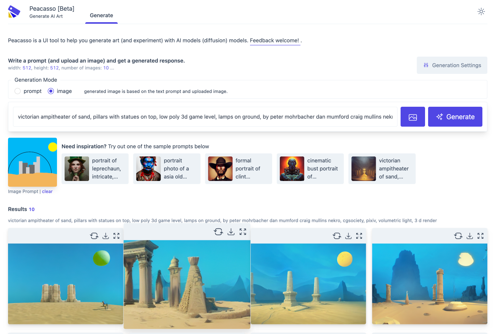

# Peacasso

[

Peacasso [Beta] is a UI tool to help you generate art (and experiment) with multimodal (text, image) AI models (stable diffusion).



## Why Use Peacasso?


Because you deserve a nice UI and great workflow that makes exploring stable diffusion models fun! But seriously, here are a few things that make Peacasson interesting:

- **Easy installation**. Instead of cobbling together command line scripts, Peacasso provides a `pip install` flow and a UI that supports a set of curated default operations.
- **UI with good defaults**. The current implementation of Peacasso provides a UI for basic operations - text and image based prompting, remixing generated images as prompts, model parameter selection. Also covers the little things .. like light and dark mode.
- **Python API**. While the UI is the focus here, there is an underlying python api which will bake in experimentation features (e.g. saving intermediate images in the sampling loop, exploring model explanations etc. . see roadmap below).

Clearly, Peacasso (UI) might not be for those interested in low level code.

## Requirements and Installation

- Step 1: **Access to Weights via HuggingFace**

  Access to the diffusion model weights requires a HuggingFace model account and access token. Please create an account at [huggingface.co](https://huggingface.co/), get an [access token](https://huggingface.co/settings/tokens) and agree to the model terms [here](https://huggingface.co/CompVis/stable-diffusion-v1-4). Next, create a `HF_API_TOKEN` environment variable containing your token. `export HF_API_TOKEN=your_token`. Note that the first time you run peacasso, the weights for the SD model are [cached locally](https://huggingface.co/transformers/v4.0.1/installation.html#caching-models) on your machine. In theory, you can download the weights, and run peacasso by pointing to the folder with the weights.

- Step 2: **Verify Environment - Pythong 3.7+ and CUDA**
  Setup and verify that your python environment is `python 3.7` or higher (preferably, use Conda). Also verify that you have CUDA installed correctly (`torch.cuda.is_available()` is true) and your GPU has about [7GB of VRAM memory](https://stability.ai/blog/stable-diffusion-public-release).

Once requirements are met, run the following command to install the library:

```bash
pip install peacasso
```

Don't have a GPU, you can still use the python api and UI in a colab notebook. See this [colab notebook](https://colab.research.google.com/github/victordibia/peacasso/blob/master/notebooks/tutorial.ipynb) for more details.

## Usage - UI and Python API

You can use the library from the ui by running the following command:

```bash
peacasso ui  --port=8080
```

Then navigate to http://localhost:8080/ in your browser.

You can also use the python api by running the following command:

```python

import os
from dotenv import load_dotenv
from peacasso.generator import ImageGenerator
from peacasso.datamodel import GeneratorConfig

token = os.environ.get("HF_API_TOKEN")
gen = ImageGenerator(token=token)
prompt = "A sea lion wandering the streets of post apocalyptic London"

prompt_config = GeneratorConfig(
    prompt=prompt,
    num_images=3,
    width=512,
    height=512,
    guidance_scale=7.5,
    num_inference_steps=50,
    mode="prompt",  # prompt, image
    return_intermediates=True, # return intermediate images in the generate dict response
)

result = gen.generate(prompt_config)
for i, image in enumerate(result["images"]):
    image.save(f"image_{i}.png")
```

## Features and Road Map

- [x] Command line interface
- [x] UI Features. Query models with multiple parametrs
  - [x] Text prompting
  - [x] Image based prompting
  - [ ] Editor (for inpainting and outpainting possibly)
  - [ ] Latent space exploration
- [ ] Experimentation tools
  - [x] Save intermediate images in the sampling loop
  - [ ] Prompt recommendation tools
  - [ ] Model explanations
  - [ ] Curation/sharing experiment results

## Acknowledgement

This work builds on the stable diffusion model and code is adapted from the HuggingFace [implementation](https://huggingface.co/blog/stable_diffusion). Please note the - [CreativeML Open RAIL-M](https://huggingface.co/spaces/CompVis/stable-diffusion-license) license associated with the stable diffusion model.
